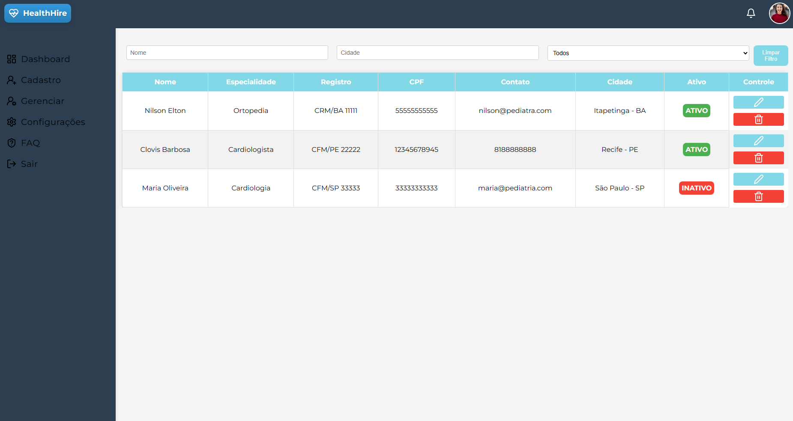
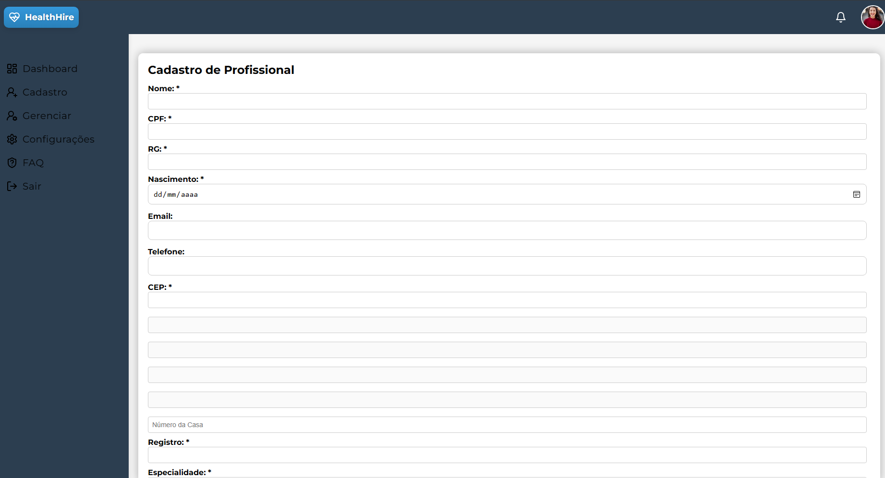

<h1 style="font-weight: bold;"> Teste front-end para saúde 🏥</h1>

## Stacks


## Screenshots
<p>
    
    
    
</p>


## Sobre

<h2>Este projeto é uma plataforma online para contratação de profissionais de saúde. Ele permite a administração e gerenciamento de todos os profissionais de saúde cadastrados na plataforma.</h2>


## Instalação e Uso

Clone o repositorio:

```bash
git clone https://github.com/bruno167/test-frontend.git

```

## Instale as dependencias 

```bash
cd test-frontend
npm install
```

## Inicie o servidor da API Fake(json-server) na porta 3000; *ja vem configurado*
```bash
npm run server
```

## inicie o projeto em seguita na porta 3001:
```bash
npm start ou npm run dev
```

## Funcionalidades
- Cadastro de novos profissionais de saúde
- Listagem de profissionais de saúde
- Edição de profissionais de saúde existentes
- Exclusão de profissionais de saúde
- Inativação de profissionais de saúde


## Observações
- Os dados dos profissionais de saúde são armazenados localmente ou podem ser simulados usando o JSON Server.


<h2 id="license">📃 License</h2>

This project is under [MIT](./License) license